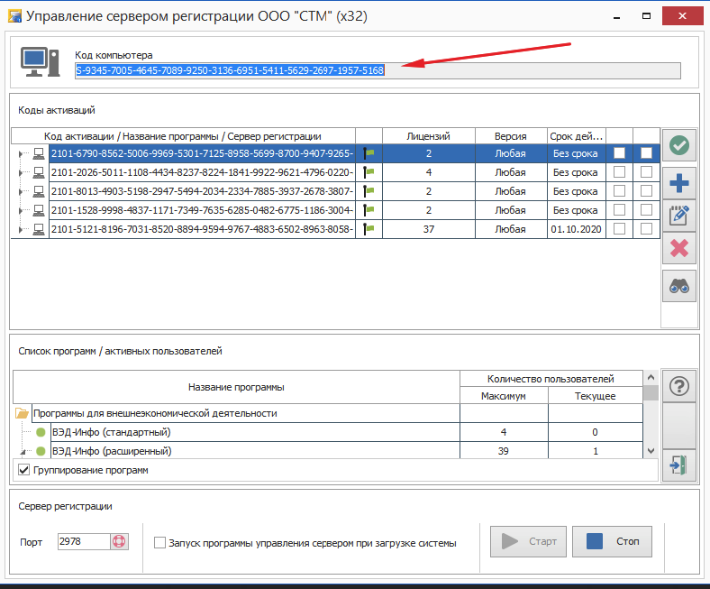
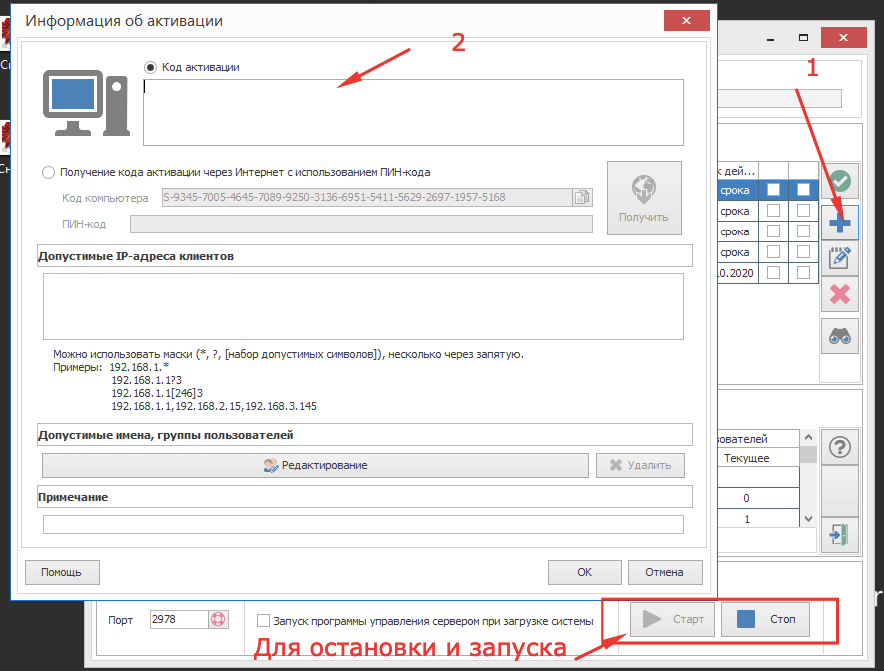
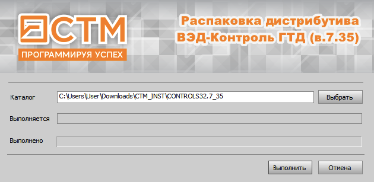
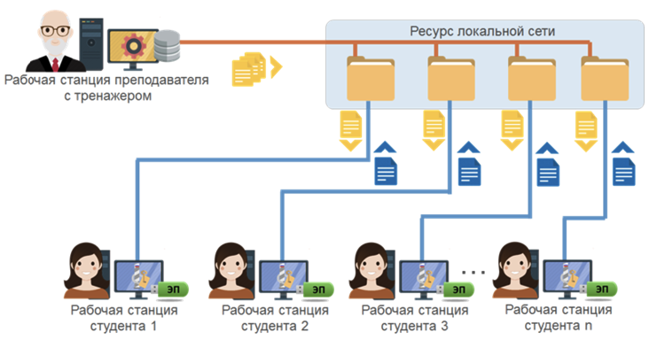
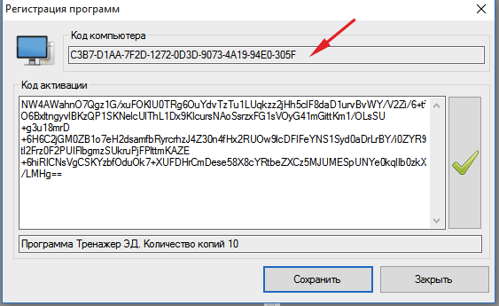
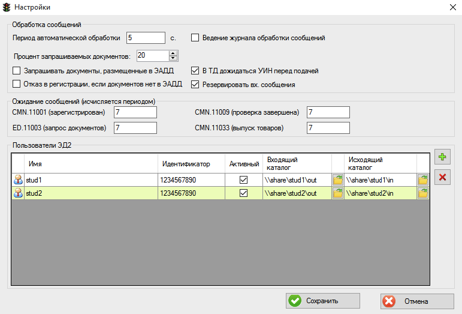
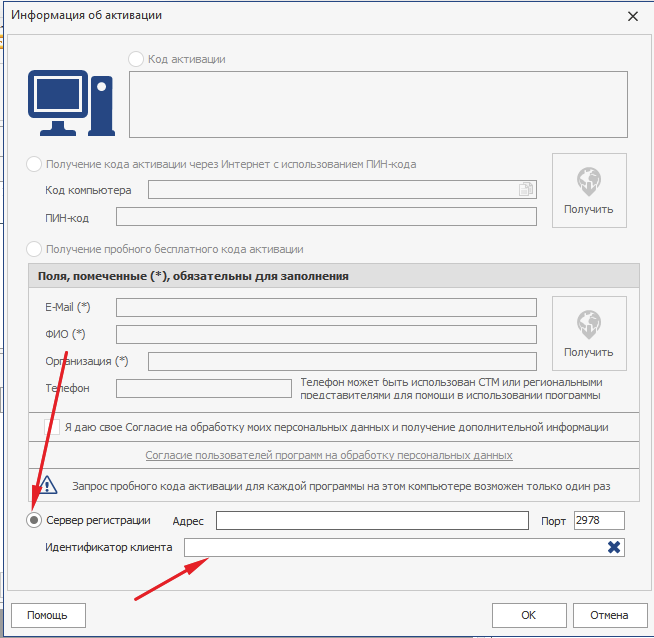
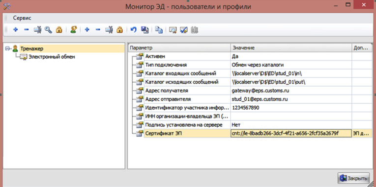

# Установка сервера регистрации программ СТМ

План
- Установка КриптоПро
- Установка сервера регистрации программ СТМ
- Активация сервера регистрации
- Установка программ СТМ
- Установка тренажера электронного декларирования 
- Настройка тренажера электронного декларирования 
- Настройка программ СТМ

## 1. Установка КриптоПро
Предполагает на компьютерах уже установлен КриптоПро CSP версии 4.0 и выше. Если нет, то необходимо их установить. 

## 2. Установка сервера регистрации программ СТМ
Сервер регистрации программы СТМ предназначен для сетевой активации программ СТМ. Обычно устанавливается на одном из компьютеров локальной сети или сервере. 

Установочный комплект [http://files.ctm.ru/INCOMING/REGSERV/setup_rs.exe](http://files.ctm.ru/INCOMING/REGSERV/setup_rs.exe)

**Особенность** устанавливать на реальную машину. На виртуальной работать не будет. Компьютер с сервером регистрации должен быть доступен со всех компьютеров дисплейного класса по IP или доменному имени.

После установки: запустить через меню Пуск-Сервер регистрации-Управление сервером регистрации и из появившегося окна прислать нам код компьютера.



## 3. Активация сервера регистрации
В ответ на код компьютера мы пришлем код активации. Код активации нужно ввести сервер регистрации: нажать кнопку с плюсом и в появившемся окне в соответствующее поле ввести код активации. После этого нужно остановить и запустить сервер регистрации (см. соответствующие кнопки в нижней части основного окна сервера регистрации)




## 4. Установка программ СТМ
Перечень программ, которые нужно установить на компьютеры:
- ВЭД-Инфо. Установочный комплект [http://ftp.ctm.ru/ctm/VEDINFO/SFX/setup_vi.exe](http://ftp.ctm.ru/ctm/VEDINFO/SFX/setup_vi.exe)
- ВЭД-Декларант. Установочный комплект http://ftp.ctm.ru/ctm/DCL/SFX/setup_dl.exe](http://ftp.ctm.ru/ctm/DCL/SFX/setup_dl.exe)
- Монитор ЭД. Установочный комплект [http://ftp.ctm.ru/ctm/MONITOR_ED/SFX/setup_me.exe](http://ftp.ctm.ru/ctm/MONITOR_ED/SFX/setup_me.exe)
- ВЭД-Алфавит. Установочный комплект [http://ftp.ctm.ru/ctm/ALPHABET/SFX/setup_al.exe](http://ftp.ctm.ru/ctm/ALPHABET/SFX/setup_al.exe)
- ВЭД-Контракт. Установочный комплект[http://ftp.ctm.ru/ctm/VEDPRICE/SFX/setup_vp.exe](http://ftp.ctm.ru/ctm/VEDPRICE/SFX/setup_vp.exe)

Процедура установки стандартная и не требует пояснения. Можно применить небольшую автоматизацию. Скаченные файлы это архивы, которые перед установкой распаковываются. Каталог распаковки показывается при запуске. 



Если все перечисленные программы распаковать, то в каталогах будет файл setup.exe. 
Данный файл можно запускать с различными ключами. Информацию по ключам [ask.ctm.ru](https://ask.ctm.ru/ru/knowledge_base/art/315/cat/73/)

Пример запуска:
```
setup.exe /CD /AUTO /HIDE /DIR="C:\Program Files (x86)\CTM\DCL\"
```

Информация по правам, которые требуются программе ВЭД-Декларант и Монитор ЭД тут [ask.ctm.ru] (https://ask.ctm.ru/ru/knowledge_base/art/25/cat/19/prava-dlja-raboti-s-programmoj)

 ## 5. Установка тренажера электронного декларирования 
 Тренажер электронного декларирования устанавливается на компьютеры преподавателя в дисплейных классах. Тренажер нужен для обработки сообщений от пользователей,  о  
 
 Установочный комплект тренажера: [https://ed2inteh.ru/app/edtrainer/setup.exe](https://ed2inteh.ru/app/edtrainer/setup.exe)

Запуск и установка данного файла стандартная для программ и не требует дополнительного описания. Рекомендуется устанавливать тренажер в каталог, для которого есть права на запись у пользователя. По умолчанию программа устанавливается в каталог c:\Program Files\EdTraine и доступна для запуска через меню Пуск->Программы-> EdTrainer ->EdTrainer.


 ## 6. Настройка тренажера электронного декларирования 
 Для настройки тренажера его нужно запустить через соответствующий пункт в меню Пуск или иконке на рабочем столе. 
 Настройка заключается в активации программы и создания каталогов обмена. Каталоги обмена нужны для взаимодействия с компьютерами студентов.


 

**Для активации** программы необходимо зайти в меню сервис регистрация и из появившегося окна скопировать код компьютера. Код компьютера прислать нам. В ответ мы пришлем код активации. Код активации необходимо вставить в окно и нажать кнопку подтверждения.



**Для настройки каталогов** необходимо для каждого компьютера на общем сетевом ресурсе создать каталоги вида:
//share/somedir/stud1/in //share/somedir/stud1/out
//share/somedir/stud2/in //share/somedir/stud2/out
....
//share/somedir/stud50/in //share/somedir/stud50/out

Далее в тренажере зайти в меню Сервис-Настройка и добавить в таблицу "Пользователи ЭД2" созданные каталоги как на картинке ниже. Имена пользователей должны быть уникальными. Например, Stud1, Stud2... (без пробелов). Идентификатор можно указать у всех одинаковый 1234567890. 



## 7. Настройка программ СТМ
Этапы настройки программы СТМ на рабочих местах
 - 7.1 Внести сетевую регистрацию программ
 - 7.2 Настройка электронной подписи документов
 - 7.3 Настройка Монитора ЭД


 7.1 Внести сетевую регистрацию программ.  Через меню Пуск-Программы-СТМ-ВЭД-Инфо запустить программу ВЭД-Инфо. В программе ВЭД-Инфо зайти в меню Сервис-Регистрация программ. В появившемся окне установить переключатель "Сервер регистрации" и поле с адресом указать адрес компьютера с установленным сервером регистрации.
 
 

 После этой операции все программы СТМ на данном компьютере будут зарегистрированы. 
 
 Для автоматизации можно сделать активацию на одном компьютере, а потом скопировать файл c:\ProgramData\CTM\Common\reginfo.xml на все остальные. Тогда не придется вручную вводить адреса.

7.2 Настройка электронной подписи документов
Скачать и установить на каждый компьютер электронную подпись. Электронную подпись можно скопировать на флешку и с помощью КриптоПро скопировать ее в реестр. [ep.zip](ep.zip)
   
7.3 Настройка Монитора ЭД
На рабочих местах необходимо настроить программу Монитор ЭД. Данная программа запускается автоматически при старте программы ВЭД-Декларант.  Для настройки программы необходимо: в системном лотке нажать правой кнопкой на иконке Монитор ЭД, в появившемся окне выбрать меню Настройка-> Пользователи и профили. В появившемся окне для соответствующего профиля необходимо (если программа скажет, что она не настроена, то зайти в настройки Монитора ЭД и там через кнопку создать создать в каталоге монитора ЭД базу):
-	В настройке "Тип подключения" указать "Обмен через каталоги".
-   Указать каталог входящих и исходящих сообщений. Для каждого свой.
-	Указать адрес получателя gateway@eps.customs.ru.
-	Указать адрес отправителя. Например, для рабочей станции с номером 1 адрес можно задать так stud_01@eps.customs.ru. Отметим, что префикс адреса должен совпадать с именем пользователя, указанного в настройках тренажера.
-	Указать четырнадцатизначный идентификатор участника информационного обмена. Например, такой 1234567890.
-	Указать сертификат электронную подпись. 
 
 